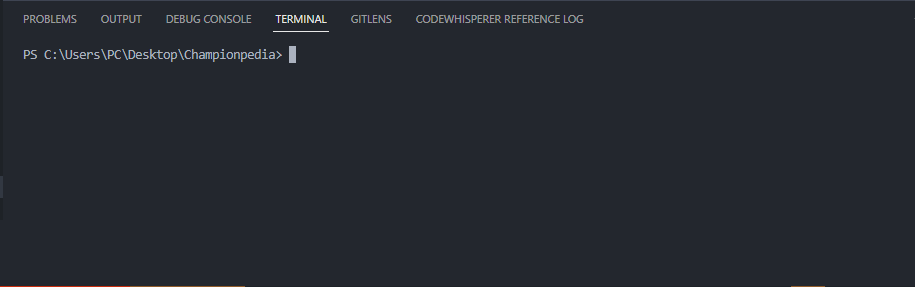
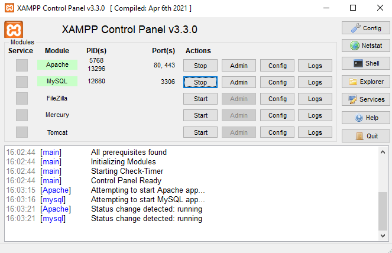
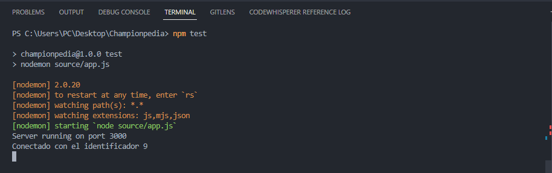

# Championpedia ⚽

Championpedia es una wiki dedicada al mundo del fútbol que ofrece a los usuarios una amplia variedad de información sobre futbolistas, copas y equipos. Este sitio web cuenta con un buscador avanzado que permite a los usuarios buscar artículos de las categorías mencionadas. Además, Championpedia brinda la oportunidad a los usuarios de crear artículos, agregar descripciones y tags, y editar los artículos existentes para corregir datos incorrectos.


## Demo 🎥

A continuación, se presente un pequeño recorrido por el sitio web:


## Características

- Buscador avanzado: los usuarios pueden buscar artículos en las categorias de futbolistas, copas y equipos utilizando palabras claves.
  
- Creación de artículos: los usuarios pueden crear artículos de acuerdo a las categorías mencionadas, agregar descripciones y tags relevantes.
  
- Edición de artículos: los usuarios también tienen la posibilidad de editar los artícuos existentes para corregir datos incorrectos.

- Últimas noticias: la vista de home muestra las últimas noticias de fútbo, así como el último artículo creado y el artículo más visto.

- Slider de categorías: en cada vista de categoría, los usuarios pueden ver un slider con los artículos relacionados con esta categoría y referencias a los artículos que los usuarios han buscado.

- Paginación: cada una de las vistas de las categorias cuenta con paginación para facilitar la navegación y permitir a los usuarios ver más artículos sin tener que desplazarse por una lista infinita.

## Tecnologías utilizadas 🛠️

Este proyecto se ha desarrollado utilizando las siguientes tecnologías:

Front-End

- React
- SCSS
- React Bootstrap
- Jodit React
- js-cookie
- React Icons
- React Router DOM
- Swiper JS
- Universal Cookie
- Vite js (herramienta de compilación)

Backend

- Node.js
- Express.js
- blob-util
- body-parser
- buffer
- cors
- dotenv
- express-validator
- jsdom
- moment
- multer
- MySQL

## Pre-requisitos 📋

Antes de levantar el proyecto Championpedia, asegúrate de tener instalado lo siguiente en tu máquina:

- Node.js y npm (administrador de paquetes de Node.js)
- XAMPP (para poder levantar la base de datos)
- Git (para poder clonar el repositorio)

Si aún no tienes instalado alguno de estos programas, descárgalos e instálalos siguiendo las instrucciones en sus sitios web oficiales.


## Levantar el proyecto 🔧

Ingresa a tu terminal (cmd, git bash, etc.) y clona el repositorio del proyecto en tu máquina local utilizando el comando 'git clone':

```
git clone https://github.com/Portero20/Championpedia.git
```

Abre el proyecto clonado en el Visual Studio Code y abre la terminal con CTRL + Ñ




Accede a la carpeta de 'frontend' e instala las dependencias utilizando npm

```
cd frontend
```
```
npm i
```


Accede a la carpeta de raíz del proyecto (Championpedia) para instalar las dependencias del backend utilizando npm

```
cd ..
```
```
npm i
```


Una vez instalada las dependencias, debemos levantar el servidor de base de datos de XAMPP y asegurate de tener habilitadas las opciones de Apache y MySQL para su funcionamiento.





Una vez hecho esto, debemos ingresar a la carpeta raiz de nuestro proyecto para crear la base de datos y las tablas necesarias, si todo sale bien aparecera el siguiente mensaje:



Ya levantada la base de datos y creadas sus tablas, accedemos a la carpeta de frontend'

```
cd frontend
```


Y levantamos nuestro servidor

```
npm run dev
```


## Equipo de desarrollo 👨‍🔧👩‍🔧

Este proyecto ha sido desarrollado por el siguiente equipo:

- [Exequiel Portero](https://www.linkedin.com/in/exequiel-portero/) - Desarrollador Fullstack
- [Julian Viera](https://www.linkedin.com/in/julian-viera/) - Desarrollador Fullstack
- [Xochitl Farias](https://www.linkedin.com/in/xfarias-scrum-master/) - Scrum
- [Cesia Castilla](https://www.linkedin.com/in/cesia-castilla/) - QA Manual
- [Edgar Monagas](https://www.linkedin.com/in/edmonagas/) - UX/UI


